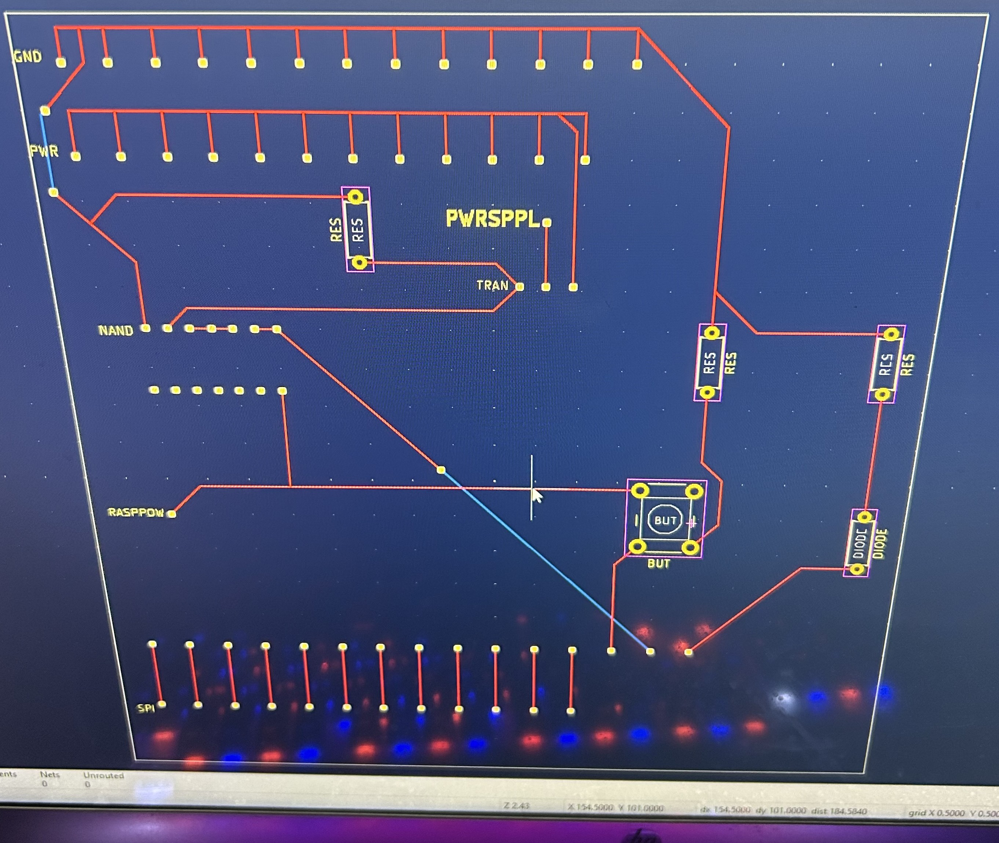

# Senior Design Spring 2024 Lab Notebook Bryson
Group: Tyler Hirsch, Bryson Maedge, Nolan Opalski  
NetId: &nbsp;thirsch3, &nbsp;&nbsp;&nbsp;&nbsp;&nbsp;&nbsp;bmaedge2, &nbsp;&nbsp;&nbsp;&nbsp;&nbsp;&nbsp;&nbsp;&nbsp;nolanfo2   
TA: &nbsp;&nbsp;&nbsp;&nbsp;&nbsp;&nbsp;Angquan Yu

## May 2nd, 2024
Added some personal thoughts to each entry of the lab notebook to make it pertain more specifically to me. Had a lot of the same information as this project was truly collaborative. Each time we met we usually met as a group and worked on it. Also turned in lab materials on time.

## May 1st, 2024
Finished our final paper today and am adding the last update to the notebook. Has been a very informative class and we all learned a lot. Thank you!

## April 30th, 2024
We each individually worked on the final paper throughout the day. Made some really solid progress only need to do the R&V Portion of the paper now. Feels very high quality. Need to add some details throughout.

## April 29th, 2024 (Presentation)
Today we had our presentation. We believe it went really well. It was at 8am which was a little bit of an early wakeup for us but our minds were sharp. I believe the professor enjoyed it and liked how we took his feedback and advocated for ourself.

## April 28th, 2024
We took the feedback from our mock presentation and edited our slides. We also ran through the presentation once and got fluid with our speaking. We are ready for this. Feeling wayyyy better than I did for the demo. 

## April 26th, 2024 (Mock Presentation)
We met at 10AM to perform our mock presentation. We got a lot of valuable feedback that we are going to apply to our slides. Presentation went far better than the demo. The communication related TA helped a lot with our actual presentation skills and the course TA helped us refine some technical displays of our project. Feeling confident going into the presentation.

## April 25th, 2024
We met at 12:30 to review everything we compiled for our presentation. We also put together our team contract fulfillment.

## April 24th, 2024
We met briefly on discord to go over rough layout of our presentation. Worked on some seperation of parts and who is going to say what. We are all good presenters so I am not worried,

## April 23rd, 2024 (Final Demo)
We demoed our project to Professor Gruev and 2 TAs. They were rather unimpressed to say the least. We didn't read the PCB requirements, so we didn't put a microcontroller on the board, so we lost points for that. We tried to explain what happened with our Raspberry Pi and the image recognition but it didn't look like they were buying it. To be fair, it does sound far-fetched. We were basically told that this stuff happens all the time and that we need to try harder. We got some really good feedback that I am glad to have heard. In the future, when I encounter problems I am going to make sure to better advocate what we did to solve them. I am kind of upset at how little we tried to explain our solution attempts because it would have made a much bigger difference. But now it is presentation time.

## April 22nd, 2024
Our Raspberry Pi came in. We retested the control of all the servos to make sure that functionality worked. We started getting a lot of errors surrounding keras and tensorflow. We spent about 4 hours trying different methods to install keras and tensorflow and it wouldn't load on this Raspberry Pi. I dont fully understand the problem since Tyler is the code wiz but things are starting to look bleak. Our image recognition just took a major step back and now it is time to demo.

## April 20th, 2024
2 panels fell off the project I noticed as I walked downstairs. We had to reglue them and do other little maintenance things like replace a servo that was not angling correctly. All went without a hitch.

## April 18th, 2024 (Mock Demo)
Tyler and Nolan demoed the project to Angquan. I was still studying for test but it worked. Was concerned about the paint, but our wires seem fine.

## April 17th, 2024
We met at noon today to test everything folding. The board was able to fold as expected. Our image recognition was not accurate, so me and Nolan painted the board black to try to achieve better results if we increased our contrast. After painting our system was correctly able to distinguish between pants and shirts. The paint hopefully did not get in any of the wiring which is a concern. We protected our servos so we will test once it dries.

## April 15-16th, 2024
Nolan and tyler did some soldering and some glueing. I had a test that I was studying for so was unable to be there.

## April 11th, 2024
We met at noon today. We almost finished rebuilding the project with 6 servos for control instead of 12. We then designed our PCB with me editing some footprints to fit our datasheet specific designs. We are going to submit an order on our own and fast track it so that we have time to mess around with it.

## April 10th, 2024
We met at 2pm today. We started rebuilding our project. I recut each panel and new risers for the servos in the morning. This allowed us to start working and thinking of new solutions right away.

## April 9th, 2024
We met at 2pm today. Last time we met, we were not able to emit enough voltage to power the servos. We were limited by the voltage supplied by the IC chip. After meeting today, we were still unable to resolve this issue and decided it would be easiest to switch our design to only utilize one servo.

## April 3rd, 2024
We met at 1pm today. The goal was to finalize how we could utilize transistors to control power to our servos. Nothing worked we need to rethink.

## April 2nd, 2024 (Fourth Round PCB Way Deadline at 4:45pm)
We met today and finished our PCB design. We sent it over to our TA for audit and it failed. We are going to send our own order in tomorrow morning. Here is a picture of our design. I am going to use my Kicad experience to make new PCB design hopefully we only need to order once.

## April 1st, 2024
We met today at 2pm to finish glueing everything. We finished:
* Glueing servo arms to panels
* Glueing servos to risers
* Glueing camera arm mount to board
* Glueing Rasperry Pi riser to board  

Before we could attach the servos to the panels, we had to set the servos on the left of the panel to an initial position of 0 degrees, and the serovs on the right of the panel to an initial position of 180 degrees. This is because they will be turning in opposite directions. So, in the "fold-up" position, the left servo will be rotated to a 120 degree angle and the right servo will be rotated to a 60 degree angle. We ran into a problem with our Raspbeery Pi today. It kept booting on and off for about 2 hours before it stabilized. We were never able to identify the cause of the problem, but we hope it does not continue and we are forced to spend another $60 on a Raspberry Pi.

We started testing once the glue finished curing. We started by rotating the servos 18 degrees and back to the starting position and it worked great. We then tried testing it by rotating the servos 90 degrees and then back. There was a loud cracking noise and we realized we overtorqued one of the servos and it was not out of commission. One of our risers is also broken, but that's an easier fix. Now, we need to order more servos before we can continue working.

We identified the problem as the PWM signal. When our code is not running and everything is connected to power, the servos are reading a PWM duty cycle of 0%, therefore they both try to rotate to their starting position. This will cause them to break, as happened during our initial test. We decided that we could fix this problem by using a PNP transistor. If the servos have no power to them, they cannot rotate, no matter what the PWM duty cycle is. Our idea is, we will set the PWM duty cycles of all the servos and then use logic to allow power to pass through to servos. Then whenever we need to stop the program or anything, we just cut power to our servos, so they don't try to rotate to a wrong position.

The Raspberry Pi's GPIO ports has a low signal of ~1.2V and a high signal of ~4.9V. This will not work as a transistor will generally start allowing passthrough voltage at anything over ~0.7V. Therefore we will need to add an IC chip, to help control this output. The IC chip will be a NAND gate as that is the easiest to convert to an AND gate and none of the 3 of us have any AND chips. (Here is a <a href="https://www.ti.com/lit/ds/symlink/sn74ac00.pdf?ts=1711955865754&ref_url=https%253A%252F%252Feu.mouser.com%252F">link</a> to the NAND gate's data sheet) The NAND gate's output will have a high signal of ~2.1V and a low signal of ~0.1V. This will allow us to properly control a transistor. We will connect our power supply's Vin to the collector pin of the transistor and connect our servos to the emitter pin of the transistor. This will allow us to control a higher voltage circuit with a lower voltage Raspberry Pi.

We tested this today with a transistor from a previous ECE class lab kit, but the maximum throughput was 3.3V. We need 5V minimum to power our servos, so we will need to order others. We also have a fleshed out version of our PCB, but are waiting on last minute parts to test on a breadboard before we submit a PCB order.

We stopped working around 8:30PM.

We are waiting on the following parts to come in:
* Spool of 22 AWG wire
* Wire stripper
* Female to male wires
* Raspberry Pi Camera cable extension
* Replacement servos (they come in packs of 4)
* Transistors

## March 27th, 2024
We met today to get some more physical aspects of the project done. Here's what we finished today:
* Glueing dowels to panels for structural support
* Built and glued 12 risers for all servos
* Built riser for Raspberry Pi
* Built camera arm
* Built mount for camera arm
Got a lot done. I am going to reglue and reinforce some of the dowels tonight since the project is at my house.

## March 25th, 2024
We met again today to start building our project. We cut out the first panels and realized we couldn't cut our dowel rods with a box cutter, so we ran back to Home Depot. We debated pruners or a saw but the pruners won for simplicity.
We bought:
* Pruners (easy way to cut dowels)
* Another dowel (Mount camera)

On the way back, we stopped at Goodwill and bought infant clothes to demo. It was awkward to have three college guys buying infant clothes haha. We finished cutting all of the dowels and started cutting the risers as well. Dowels did not cut as clean as we hoped but overall it worked well.

## March 21st, 2024
Met at noon today. Despite the ugly look we are going to use cardboard because its cheap and easy to manipulate. We would reinforce the cardboard with dowel rods and use superglue/gorilla glue to hold everything together. Hopefully this allows our servos to connect flawlessly.

We did a Home Depot run. We bought:
* 2 Heavy duty cardboard boxes. 
    * 1 will be used as a baseplate for the entire project
    * The other will be cut up and used as panels for folding clothes and as risers for the servos
* Box cutter
    * Cut cardboard
* Dowel rod
    * Cut into pieces and used to mount servos to panels
* Gorilla glue
    * Mount risers to baseplate and servos to risers
    * Mount dowel rod to servo

## March 19th, 2024
After a series of emails were sent around, we were able to locate the rest of our Amazon order. We had a team meeting at 3pm to discuss project details and to pick up the rest of our order.  
We met with Angquan for our weekly check-in at 4pm.  
After the meeting we experimented with our Servos to make sure we could control 2 of them simultaneously. We had some issues regarding this need to reconsider design or amplify voltage using transistors.

## March 6th, 2024
We went to the ECEB to pick up our amazon order that we placed through ECE Illinois. Part of our order was missing. Started emailing around to find where the rest of the order could be. Worried it was lost in the mail.

## February 27th, 2024 (Design Review Date)
We presented our Design Document to 3 TAs and Professor Viktor Gruev. Some feedback that was provided:
* Find other voltage regulator. Linear one we are currently using allows more power dissipation.
* Use children's clothes. Will scale size of model down and can save on materials. This ended up saving us a lot of headache.
* Include more data about architecture and design of Image Recognition subsystem. Such as how many layers, what features we use to classify, etc., and why we chose all those.
* Add what data is being transferred in the block diagram
* Add temperature to Tolerance Analysis using the equation we already had on our design doc. 

Great feedback feel like we are in a better position now.

## February 26th, 2024
We determined who was going to present each part of the design document tomorrow and had a few practice presentations. 

We found out that 3-D printing everything would be very expensive. We are looking at different materials to make the panels. Planning a trip to home depot to check out some possible options.

## Februrary 22nd, 2024 (Design Document Due Date)
We finalized our <a href="https://github.com/THirsch62/ECE-445/blob/main/Design%20Document.pdf">Design Document</a>, referencing the <a href="https://courses.engr.illinois.edu/ece445/documents/grading_rubrics/DD_evalsheet.pdf">evaluation sheet</a> to make sure that we met all the requirements.

## Februrary 21st, 2024
We met today to revise our Design Document and started CAD modeling. We determined how much 3D printing would cost us and also placed an Amazon order through ECE Illinois for all parts we need to start our initial testing. 3D printing was too pricy we are going to have to reconsider.

## February 20th, 2024
We finished a rough draft of our Design Document and reviewed it with our TA. We determined that our graphics should be more detailed and our verification steps should be more objective. Making the graphics proved to be challenging software wise.

## February 19th 2024
We started a rough draft of our Design Document. We plan to work on it tonight and tomorrow. This way, we'll have a good outline before meeting with our TA so we can get any help if needed. Went well still on good progress.

## February 18th 2024
Called and requested 3D printing pricing. Sent some emails regarding 3D printing as well.

## February 12th 2024
We discussed parts required for initial testing:
* Servos
* RaspberryPi 4
* Camera
* Frame to mount servos to
* Panel to attach to servos and test folding mechanism

We put together a shopping list with amazon links to stuff we need to purchase over discord for testing so we can discuss purchasing procedure with our TA tomorrow. We are going to work on CAD next for the camera mount and paneling. We need to check pricing for that.

## February 9th 2024 (Team Contract Due Date)
We discussed guidelines, goals and expectations today. Following that discussion, we put together our <a href="https://github.com/THirsch62/ECE-445/blob/main/ECE445_Team_48_Contract.pdf">Team Contract</a> and submitted on Canvas. Overall, we are on good track.

## February 8th 2024 (Project Proposal Due Date)
We collaborated over discord to make revisions in accordance to feedback provided by our Ta.  
<a href="https://github.com/THirsch62/ECE-445/blob/main/Project%20Proposal.pdf">Project Proposal</a> was submitted by Nolan on Canvas.
Tyler started to work on the code.

## February 7th 2024 (First TA meeting)
We met with our TA (Angquan Yu) at 4pm. Recieved feedback on current status of our project Proposal. This information is listed below and will be used in our project report.
Feedback summary:  
* Needs to be more detailed
* Clarified that PCB will be part of servo subsystem in our physical system  

