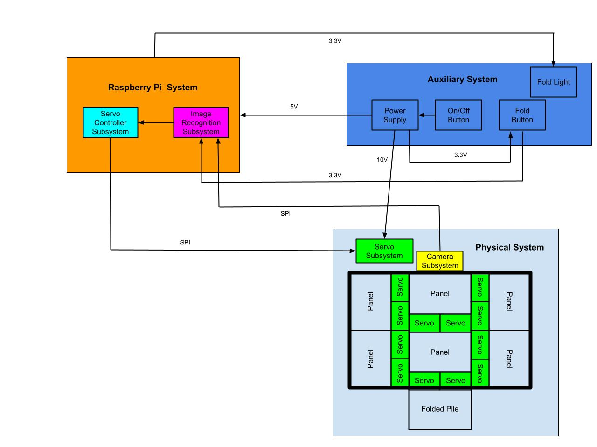

# Senior Design Spring 2024 Lab Notebook
Group: Tyler Hirsch, Bryson Maedge, Nolan Opalski  
NetId: &nbsp;thirsch3, &nbsp;&nbsp;&nbsp;&nbsp;&nbsp;&nbsp;bmaedge2, &nbsp;&nbsp;&nbsp;&nbsp;&nbsp;&nbsp;&nbsp;&nbsp;nolanfo2   
TA: &nbsp;&nbsp;&nbsp;&nbsp;&nbsp;&nbsp;Angquan Yu

## February 8th 2024 (Project Proposal Due Date)
We collaborated over discord to make revisions in accordance to feedback provided by our Ta.  
Project Proposal was submitted by Nolan on Canvas.

## February 7th 2024 (First TA meeting)
We met with our TA (Angquan Yu) at 4pm. Recieved feedback on current status of our project Proposal.  
Feedback summary:  
* Needs to be more detailed
* Clarified that PCB will be part of servo subsystem in our physical system  

