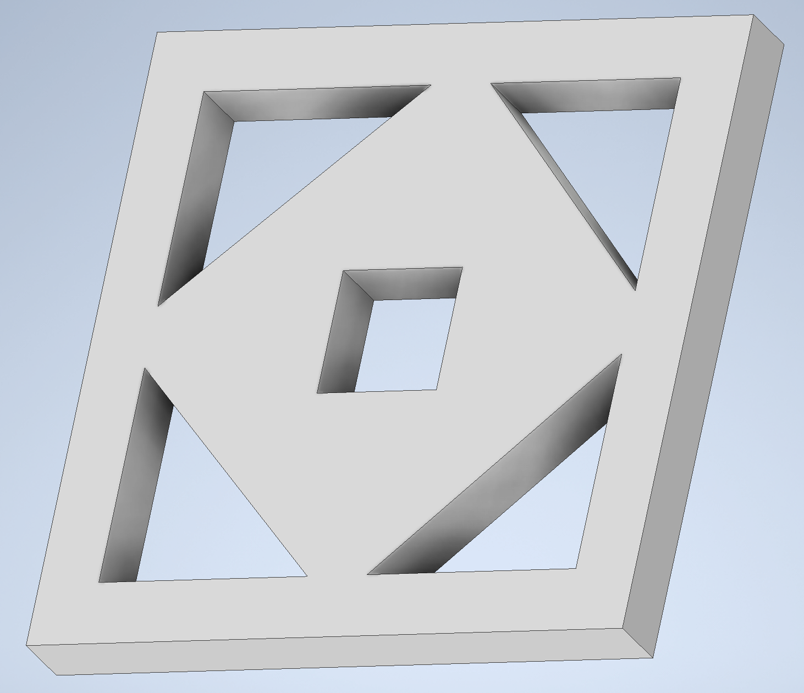
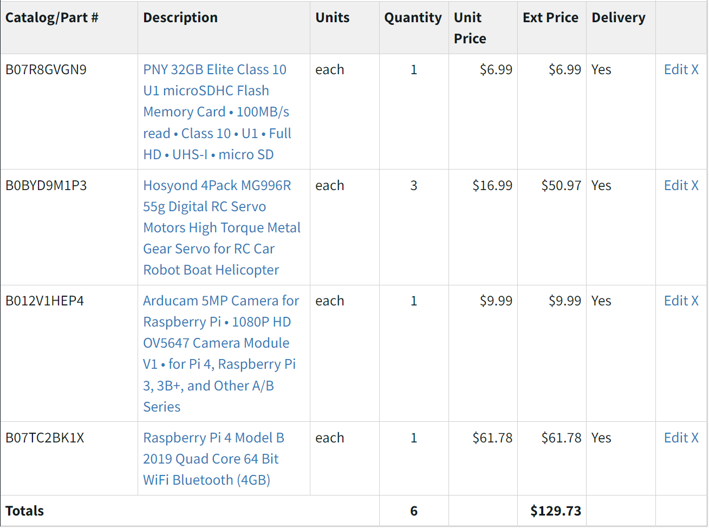
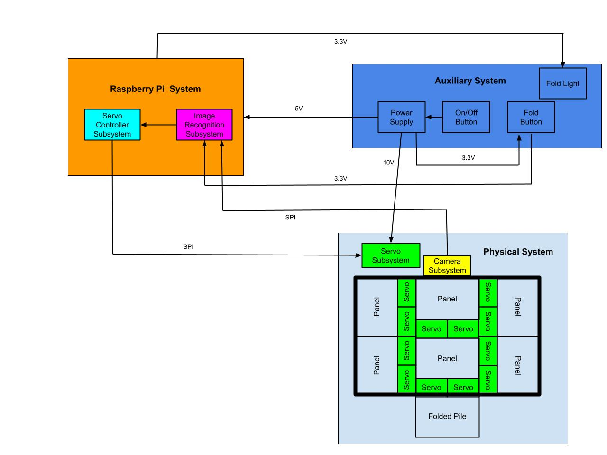

# Senior Design Spring 2024 Lab Notebook
Group: Tyler Hirsch, Bryson Maedge, Nolan Opalski  
NetId: &nbsp;thirsch3, &nbsp;&nbsp;&nbsp;&nbsp;&nbsp;&nbsp;bmaedge2, &nbsp;&nbsp;&nbsp;&nbsp;&nbsp;&nbsp;&nbsp;&nbsp;nolanfo2   
TA: &nbsp;&nbsp;&nbsp;&nbsp;&nbsp;&nbsp;Angquan Yu

## April 1st, 2024
We met today at 2pm to finish glueing everything. We finished:
* Glueing servo arms to panels
* Glueing servos to risers
* Glueing camera arm mount to board
* Glueing Rasperry Pi riser to board  

Before we could attach the servos to the panels, we had to set the servos on the left of the panel to an initial position of 0 degrees, and the serovs on the right of the panel to an initial position of 180 degrees. This is because they will be turning in opposite directions. So, in the "fold-up" position, the left servo will be rotated to a 120 degree angle and the right servo will be rotated to a 60 degree angle. We ran into a problem with our Raspbeery Pi today. It kept booting on and off for about 2 hours before it stabilized. We were never able to identify the cause of the problem, but we hope it does not continue and we are forced to spend another $60 on a Raspberry Pi.

We started testing once the glue finished curing. We started by rotating the servos 18 degrees and back to the starting position and it worked great. We then tried testing it by rotating the servos 90 degrees and then back. There was a loud cracking noise and we realized we overtorqued one of the servos and it was not out of commission. One of our risers is also broken, but that's an easier fix. Now, we need to order more servos before we can continue working.

We identified the problem as the PWM signal. When our code is not running and everything is connected to power, the servos are reading a PWM duty cycle of 0%, therefore they both try to rotate to their starting position. This will cause them to break, as happened during our initial test. We decided that we could fix this problem by using a PNP transistor. If the servos have no power to them, they cannot rotate, no matter what the PWM duty cycle is. Our idea is, we will set the PWM duty cycles of all the servos and then use logic to allow power to pass through to servos. Then whenever we need to stop the program or anything, we just cut power to our servos, so they don't try to rotate to a wrong position.

The Raspberry Pi's GPIO ports has a low signal of ~1.2V and a high signal of ~4.9V. This will not work as a transistor will generally start allowing passthrough voltage at anything over ~0.7V. Therefore we will need to add an IC chip, to help control this output. The IC chip will be a NAND gate as that is the easiest to convert to an AND gate and none of the 3 of us have any AND chips. (Here is a <a href="https://www.ti.com/lit/ds/symlink/sn74ac00.pdf?ts=1711955865754&ref_url=https%253A%252F%252Feu.mouser.com%252F">link</a> to the NAND gate's data sheet) The NAND gate's output will have a high signal of ~2.1V and a low signal of ~0.1V. This will allow us to properly control a transistor. We will connect our power supply's Vin to the collector pin of the transistor and connect our servos to the emitter pin of the transistor. This will allow us to control a higher voltage circuit with a lower voltage Raspberry Pi.

We tested this today with a transistor from a previous ECE class lab kit, but the maximum throughput was 3.3V. We need 5V minimum to power our servos, so we will need to order others. We also have a fleshed out version of our PCB, but are waiting on last minute parts to test on a breadboard before we submit a PCB order.

We stopped working around 8:30PM.

We are waiting on the following parts to come in:
* Spool of 22 AUG wire
* Wire stripper
* Female to male wires
* Raspberry Pi Camera cable extension
* Replacement servos (they come in packs of 4)
* Transistors

## March 27th, 2024
We met today to get some more physical aspects of the project done. Here's what we finished today:
* Glueing dowels to panels for structural support
* Built and glued 12 risers for all servos
* Built riser for Raspberry Pi
* Built camera arm
* Built mount for camera arm

## March 25th, 2024
We met again today to start building our project. We cut out the first panels and realized we couldn't cut our dowel rods with a box cutter, so we ran back to Home Depot. We bought:
* Pruners (easy way to cut dowels)
* Another dowel (Mount camera)

On the way back, we stopped at Goodwill and bought infant clothes to demo. We finished cutting all of the dowels and started cutting the risers as well.

## March 21st, 2024
We met at noon today to do a Home Depot run. We bought:
* 2 Heavy duty cardboard boxes. 
    * 1 will be used as a baseplate for the entire project
    * The other will be cut up and used as panels for folding clothes and as risers for the servos
* Box cutter
    * Cut cardboard
* Dowel rod
    * Cut into pieces and used to mount servos to panels
* Gorilla glue
    * Mount risers to baseplate and servos to risers
    * Mount dowel rod to servo

## March 19th, 2024
After a series of emails were sent around, we were able to locate the rest of our Amazon order. We had a team meeting at 3pm to discuss project details and to pick up the rest of our order.  
We met with Angquan for our weekly check-in at 4pm.  
After the meeting we experimented with our Servos to make sure we could control 2 of them simultaneously.

## March 6th, 2024
We went to the ECEB to pick up our amazon order that we placed through ECE Illinois. Part of our order was missing. Started emailing around to find where the rest of the order could be.

## February 27th, 2024 (Design Review Date)
We presented our Design Document to 3 TAs and Professor Viktor Gruev. Some feedback that was provided:
* Find other voltage regulator. Linear one we are currently using allows more power dissipation.
* Use children's clothes. Will scale size of model down and can save on materials.
* Include more data about architecture and design of Image Recognition subsystem. Such as how many layers, what features we use to classify, etc., and why we chose all those.
* Add what data is being transferred in the block diagram
* Add temperature to Tolerance Analysis

## February 26th, 2024
We determined who was going to present each part of the design document tomorrow and had a few practice presentations. 

We found out that 3-D printing everything would be very expensive. So we decided that we'll use 2x2's or something of the like from Home Depot for the frame. A veneer or polyester sheet for the panels. And then we would 3-D print the mounting mechanisms so that we ensure a proper fit for the servos.

## Februrary 22nd, 2024 (Design Document Due Date)
We finalized our <a href="https://github.com/THirsch62/ECE-445/blob/main/Design%20Document.pdf">Design Document</a>, referencing the <a href="https://courses.engr.illinois.edu/ece445/documents/grading_rubrics/DD_evalsheet.pdf">evaluation sheet</a> to make sure that we met all the requirements.

## Februrary 21st, 2024
We met today to revise our Design Document and started CAD modeling. We determined how much 3D printing would cost us and also placed an Amazon order through ECE Illinois for all parts we need to start our initial testing.
  
Here is the start of what our panels will look like:

The dimensions are 10"x10"x1".
  
Here is our purchase order:

## February 20th, 2024
We finished a rough draft of our Design Document and reviewed it with our TA. We determined that our graphics should be more detailed and our verification steps should be more objective.

## February 19th 2024
We started a rough draft of our Design Document. We plan to work on it tonight and tomorrow. This way, we'll have a good outline before meeting with our TA so we can get any help if needed.

## February 18th 2024
Sent emails asking for discounts/sponsored free parts to:
- DFRobots (Servos)
- RaspberryPi (RaspberryPi4 and camera module)
- Siebel Center for Design (3-D printing)

## February 12th 2024
We discussed parts required for initial testing:
* Servos
* RaspberryPi 4
* Camera
* Frame to mount servos to
* Panel to attach to servos and test folding mechanism

We put together a shopping list with amazon links to stuff we need to purchase for testing so we can discuss purchasing procedure with our TA tomorrow. We also need to discuss the procedure for getting CAD models 3-D printed as our frame and panels will most likely be 3-D printed.

## February 9th 2024 (Team Contract Due Date)
We discussed guidelines, goals and expectations today. Following that discussion, we put together our <a href="https://github.com/THirsch62/ECE-445/blob/main/ECE445_Team_48_Contract.pdf">Team Contract</a> and submitted on Canvas.

## February 8th 2024 (Project Proposal Due Date)
We collaborated over discord to make revisions in accordance to feedback provided by our Ta.  
<a href="https://github.com/THirsch62/ECE-445/blob/main/Project%20Proposal.pdf">Project Proposal</a> was submitted by Nolan on Canvas.
  
Started <a href="https://github.com/THirsch62/ECE-445/tree/main/python_code">python code</a> for image recognition:
* Import dataset from MNIST
* Isolate and extract part of data we need (training images and labels for: tshirts, pullovers, trousers)
* Train CNN on extracted data (model predicts with 97.7% accuracy on test dataset)
* Save trained model to sdcard
* Load trained model into memory
* Function to accept image and output predicted classification

Miscellaneous code:
* Created general layout for future functions
* TODO: Function to normalize image from camera. Will consist of cropping image to just clothing item and resizing image to 28x28 pixels
* TODO: Set up basic servo control function. Input parameter will be int corresponding to panel to fold. Function will execute folding for that panel
* TODO: Figure out folding pattern/series of ints to pass to servo control function. Need 3 foloding patterns for all clothing types

## February 7th 2024 (First TA meeting)
We met with our TA (Angquan Yu) at 4pm. Recieved feedback on current status of our project Proposal.  
Feedback summary:  
* Needs to be more detailed
* Clarified that PCB will be part of servo subsystem in our physical system  

